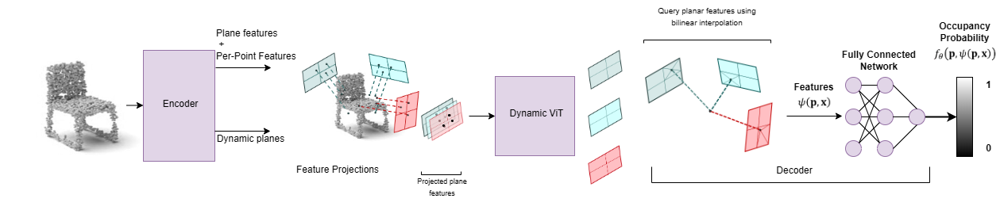

# TransConvONet: Lightweight Transformer Occupancy Networks for 3D virtual object reconstruction
[**Paper**](GRAPP_2025_396_CR.pdf)



This repository contains the implementation of the paper:

Lightweight Transformer Occupancy Networks for 3D virtual object reconstruction  
Claudia Melis Tonti [https://github.com/Allyjuke96] and Irene Amerini
**GRAPP 2025**  

If you find our code or paper useful, please consider citing us:

```bibtex
@INPROCEEDINGS{Tonti2025-ay,
  title           = "Lightweight transformer occupancy networks for {3D}
                     virtual object reconstruction",
  booktitle       = "Proceedings of the 20th International Joint Conference on
                     Computer Vision, Imaging and Computer Graphics Theory and
                     Applications",
  author          = "Tonti, Claudia and Amerini, Irene",
  publisher       = "SCITEPRESS - Science and Technology Publications",
  pages           = "408--414",
  year            =  2025,
  conference      = "20th International Conference on Computer Graphics Theory
                     and Applications",
  location        = "Porto, Portugal"
}
```

## Installation

Install [Docker](https://docs.docker.com/engine/install/) or [Podman](https://podman.io/docs/installation). If you use podman you just need to replace "docker" command with "podman" command.

Configure [DockerFile](Dockerfile) at line 47 and 48
```
ARG USERNAME=yourusername
ARG USER_UID=youruserid
```

Create a Docker image 

```
docker build -t DOCKERHUB_ACCOUNT/docker_img_name:latest . #make sure to stay in the root folder
```
Run Docker container

```
docker run -it --device nvidia.com/gpu=0 --shm-size 8gb --build-arg root_password=your_pwd -v /path/to/project:/workspace  /path/to/shapenet/dataset:/dataset   /path/to/synthetic_room_dataset:/synthetic_room_dataset  /path/to/other/folders:/watertight --name container_name docker_img_name
```
The watertight dataset indicates the Ground Truth dataset, you may want to add GT synthetic_room_dataset 
To access the container
 
## Dataset

To evaluate a pretrained model or train a new model from scratch, you have to obtain the respective dataset.
In this paper, we consider the ShapeNet and synthetic room dataset:

### ShapeNet
You can download the dataset (73.4 GB) by running the [script](https://github.com/autonomousvision/occupancy_networks#preprocessed-data) from Occupancy Networks. After, you should have the dataset in `data/ShapeNet` folder.
Or by calling the command 
```
bash scripts/download_shape_net_data.sh
```
### Synthetic room 
You can download the synthetic room dataset by downloading it from this [link](https://drive.google.com/drive/u/0/folders/1Q90gkAUHKyT4-Lj1klPKbqlLLw87tVn8)

### Configuration
Choose one of the configuration .yaml files in the [configs/pointcloud folder](configs/pointcloud). Replace the "path" value with the path to the dataset (synthetic_room_dataset for rooms config file and ShapeNet dataset for shapenet config file), if there is a watertight path replace the value with the path to the watertight datset. If you have a pretrained model replace the "model_file" value with the path to the .pt file of the pretrained model, otherwise type "None"

### Mesh Generation
To generate meshes using a trained model, use
```
python generate.py CONFIG.yaml
```
where you replace `CONFIG.yaml` with the correct config file. Our configurations can be found in configs folder.
 
### Evaluation
For evaluation of the models, we provide the script `eval_meshes.py`. You can run it using:
```
python eval_meshes.py CONFIG.yaml
```
The script takes the meshes generated in the previous step and evaluates them using a standardized protocol. The output will be written to `.pkl/.csv` files in the corresponding generation folder which can be processed using [pandas](https://pandas.pydata.org/).

### Training
Finally, to train a new network from scratch, run:
```
python train.py CONFIG.yaml
```
For available training options, please take a look at `configs/default.yaml` and `configs/pointcloud/shapenet_dynamic_3plane.yaml`.

If you want to run these commands on CPU add flag to the command:

```
--no-cuda
```

### Configuration file setup for training
This part will explain how to modify `configs/pointcloud/shapenet_dynamic_3plane.yaml` to run according to your wishes.

#### **Loss Similarity**

To run with similarity loss you should put the `training.similarity = True` On the opposite, put it to `False` 


## Acknowledgement
The code is inherited from the official repository of [Dynamic Plane Convolutional Occupancy Networks](https://github.com/dsvilarkovic/dynamic_plane_convolutional_onet).
